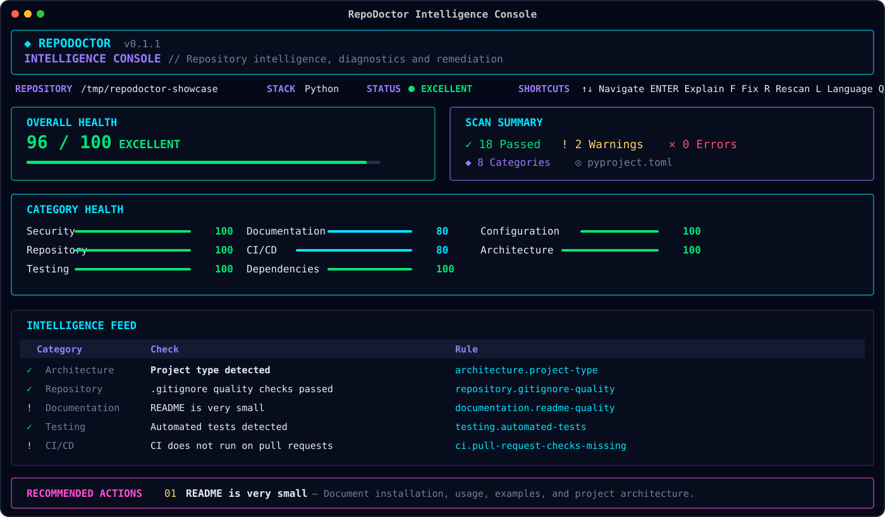

<div align="center">

# RepoDoctor

### Repository health analyzer for security, testing, CI/CD, dependencies, documentation, and architecture

[](https://github.com/BLCCoreStudio/RepoDoctor/releases/tag/v0.1.1)


[](LICENSE)

**Analyze repository health, prioritize code-quality findings, and fix what matters first from the CLI or interactive terminal interface.**

[Release v0.1.1](https://github.com/BLCCoreStudio/RepoDoctor/releases/tag/v0.1.1) · [GitHub Action](ACTION.md) · [Security](SECURITY.md) · [Changelog](CHANGELOG.md) · [Contributing](CONTRIBUTING.md)

</div>

---

RepoDoctor is a developer tool for repository analysis and code health diagnostics across **security, testing, documentation, CI/CD, dependencies, configuration, repository structure, and architecture**. It combines repository-level static analysis signals with prioritized findings so you can understand what is wrong, why it matters, and what to fix first in local projects or GitHub repositories.

It is designed around three questions:

> **How healthy is this repository?**  
> **What is wrong with it?**  
> **What should be fixed first?**

## Intelligence Console Preview



The preview above is derived from the verified Textual release-candidate render against a controlled example repository. Repository scores and findings vary with the project being analyzed.

## Quick Start

Download and extract the verified [RepoDoctor v0.1.1 Linux release](https://github.com/BLCCoreStudio/RepoDoctor/releases/tag/v0.1.1), then run:

```bash
# Scan the current repository
./repodoctor scan .

# Analyze a public GitHub repository
./repodoctor scan https://github.com/owner/repository

# Open the interactive terminal interface for a local repository
./repodoctor ui .
```

No Python installation, virtual environment, pip, or uv is required for the prebuilt Linux package.

## GitHub Action

The Marketplace Action is named **RepoDoctor CI**. It runs RepoDoctor against a repository already checked out on a Linux x86_64 GitHub Actions runner and supports repository-score and finding-severity quality gates.

The Action wrapper is security-conscious: it uses read-only workflow permissions, pins the RepoDoctor engine release and SHA-256 digest, bounds network retries/timeouts, validates archive paths before extraction, and restricts scan targets to `GITHUB_WORKSPACE`.

After the first Marketplace release is published, use the published tag rather than `main`:

```yaml
name: Repository Health

on:
  pull_request:
  push:
    branches: [main]

permissions:
  contents: read

jobs:
  repodoctor:
    runs-on: ubuntu-latest
    timeout-minutes: 10
    steps:
      - name: Checkout repository
        uses: actions/checkout@3d3c42e5aac5ba805825da76410c181273ba90b1 # v7

      - name: Run RepoDoctor
        uses: BLCCoreStudio/RepoDoctor@<published-tag>
        with:
          path: .
          fail-under: "80"
          fail-on: warning
```

See [ACTION.md](ACTION.md) for inputs, examples, security details, and current limitations.

## Public Preview

**Current version:** `0.1.1`  
**Status:** Alpha

> [!IMPORTANT]
> This repository is the official public home, product showcase, and release distribution point for the RepoDoctor alpha preview. The complete RepoDoctor analysis engine is proprietary and is developed in a separate private repository.

This public repository contains verified release binaries and checksums, product documentation, release history, security policy, and selected non-core showcase material. The proprietary core engine is not distributed here as source code, but the published RepoDoctor application can be downloaded and used directly from the official release artifacts.

## What RepoDoctor Does

RepoDoctor provides repository diagnostics across eight weighted categories:

| Category | Weight |
| --- | ---: |
| Security | 25% |
| Repository | 12% |
| Testing | 18% |
| Documentation | 10% |
| CI/CD | 10% |
| Dependencies | 10% |
| Configuration | 10% |
| Architecture | 5% |

The result is both an overall repository health score and a prioritized explanation of the problems responsible for that score.

## Highlights

- Repository health scoring
- Security hygiene diagnostics
- Repository structure analysis
- Testing diagnostics
- Documentation analysis
- CI/CD intelligence
- Dependency diagnostics
- Configuration analysis
- Architecture diagnostics
- Repository-level static analysis signals
- Local repository scanning
- GitHub repository scanning
- Stable diagnostic rule IDs
- Built-in rule explanations
- Conservative automated fixes
- SAFE vs REVIEW fix classification
- Terminal reports
- JSON reports
- HTML reports
- CI quality gates
- English and Turkish interfaces
- Interactive terminal Intelligence Console

## Intelligence Console

RepoDoctor includes a full-screen terminal interface for interactive repository inspection.

Typical usage:

```console
repodoctor ui .
```

Turkish interface:

```console
repodoctor ui . --lang tr
```

The interface provides:

- Overall repository health
- Category scores
- Finding counts
- Technology metadata
- Interactive diagnostic feed
- Rule explanations
- Recommended actions
- Fix planning
- Repository rescanning
- Runtime EN/TR switching

Keyboard controls are visible directly inside the interface:

```text
↑↓       Navigate findings
ENTER    Explain selected rule
F        Open Fix Intelligence
R        Rescan repository
L        Switch language
Q        Quit
```

The interactive UI currently operates on local repositories.

## CLI

RepoDoctor is also designed for traditional terminal and automation workflows.

### Scan a repository

```console
repodoctor scan .
```

### Scan a public GitHub repository

```console
repodoctor scan https://github.com/owner/repository
```

### Turkish output

```console
repodoctor scan . --lang tr
```

### Explain a diagnostic rule

```console
repodoctor explain architecture.large-python-class
```

### Preview safe fixes

```console
repodoctor fix .
```

### Apply SAFE fixes

```console
repodoctor fix . --apply
```

### Generate JSON

```console
repodoctor scan . --format json
```

### Generate HTML

```console
repodoctor scan . \
    --format html \
    --output repodoctor-report.html
```

## Quality Gates

RepoDoctor can be used as a CI quality gate.

Require a minimum repository score:

```console
repodoctor scan . --fail-under 90
```

Fail when warnings are detected:

```console
repodoctor scan . --fail-on warning
```

Combine both:

```console
repodoctor scan . \
    --fail-under 90 \
    --fail-on warning
```

## Safe Autofix Philosophy

RepoDoctor separates repair suggestions into two classes.

### SAFE

Changes considered sufficiently predictable for automatic application.

### REVIEW

Changes requiring human judgment.

REVIEW fixes are never automatically applied.

The autofix system is intentionally conservative: repository modification should be safer than the recommendation that triggered it.

## Security

RepoDoctor includes repository-security hygiene diagnostics such as:

- Common sensitive files tracked by Git
- Supported secret-pattern detection
- Security policy detection
- Dependency-related repository signals
- Repository configuration checks

Detected secret values are not intentionally printed into RepoDoctor diagnostic output.

RepoDoctor is not a replacement for a dedicated security audit, professional penetration test, or specialized secret-management system.

See [SECURITY.md](SECURITY.md) for vulnerability reporting guidance.

## Architecture Intelligence

Supported architecture diagnostics include signals such as:

- Large source files
- Large Python classes
- Large Python functions
- Deep source layouts
- Excessive source concentration
- Python syntax failures
- Conventional source-tree structure

Architecture checks are intended to surface maintainability risks rather than mandate a single coding style.

## Supported Project Detection

RepoDoctor currently recognizes common repository markers for technologies including:

- Python
- Node.js / JavaScript
- Rust
- Go
- Java / Maven
- Java / Gradle
- Ruby
- PHP
- .NET
- Docker

Technology-specific intelligence will continue to expand.

## Download & Installation

RepoDoctor is distributed as prebuilt application packages. The proprietary implementation source code is not required to use the application.

### Linux x86_64

**Status:** Verified  
**Minimum build target:** glibc 2.31+

**Official release:** [RepoDoctor v0.1.1](https://github.com/BLCCoreStudio/RepoDoctor/releases/tag/v0.1.1)

Download:

- [`RepoDoctor-v0.1.1-linux-x86_64.tar.gz`](https://github.com/BLCCoreStudio/RepoDoctor/releases/download/v0.1.1/RepoDoctor-v0.1.1-linux-x86_64.tar.gz)
- [`SHA256SUMS.txt`](https://github.com/BLCCoreStudio/RepoDoctor/releases/download/v0.1.1/SHA256SUMS.txt)

Extract:

```bash
tar -xzf RepoDoctor-v0.1.1-linux-x86_64.tar.gz
cd RepoDoctor-v0.1.1-linux-x86_64
```

Run:

```bash
./repodoctor version
./repodoctor scan .
./repodoctor ui .
```

No Python installation, virtual environment, pip, or uv is required.

Verify the archive:

```bash
sha256sum -c SHA256SUMS.txt
```

### Platform Support

| Platform | Status |
| --- | --- |
| Linux x86_64 | Verified · glibc 2.31+ |
| Windows | Not yet officially verified or released |
| macOS | Not yet officially verified or released |

### Source Distribution

The complete RepoDoctor implementation is not distributed as source code through this public repository.

Official binaries are built from the privately maintained BLCCoreStudio development repository and published as reviewed release artifacts.

The public repository is not intended to be a buildable copy of the proprietary RepoDoctor engine.

## Public Repository Model

BLCCoreStudio maintains RepoDoctor using a split development model:

```text
Private development repository
        │
        ├── analysis engine
        ├── diagnostics
        ├── autofix implementation
        ├── GitHub intelligence
        ├── internal tests
        └── release engineering

                ↓ reviewed export

Public repository
        │
        ├── product documentation
        ├── release history
        ├── security policy
        ├── selected showcase material
        └── public release information
```

The public export is whitelist-controlled to reduce the risk of accidentally publishing proprietary implementation files.

The public repository validation workflow checks required public files, enforces the tracked-file whitelist, rejects sensitive file types, and blocks designated private implementation paths.

## Public Source Disclosure

Files visible in this repository are intentionally selected for public inspection.

Their visibility does **not** imply that the complete RepoDoctor implementation is open source.

No rights beyond those explicitly stated in the repository license are granted.

## Current Limitations

RepoDoctor `0.1.1` is an alpha release.

Current limitations include:

- The interactive interface currently accepts local repositories only.
- Autofix intentionally supports a conservative subset of repository modifications.
- Secret detection is pattern-based.
- Technology-specific depth varies by ecosystem.
- The Marketplace Action currently supports Linux x86_64 runners only.
- Repository health scores are engineering signals, not proof of correctness or security.

## Release History

See [CHANGELOG.md](CHANGELOG.md).

## Security Reports

Please review [SECURITY.md](SECURITY.md) before reporting a security issue.

Do not include credentials, private keys, API tokens, or confidential repository data in public reports.

## Rights and Licensing

RepoDoctor is proprietary software.

Copyright © 2026 BLCCoreStudio.

All rights reserved.

Public visibility of selected files does not constitute an open-source license.

See [LICENSE](LICENSE) for the applicable terms.

---

<div align="center">

**Built by BLCCoreStudio.**

[Release](https://github.com/BLCCoreStudio/RepoDoctor/releases/tag/v0.1.1) · [GitHub Action](ACTION.md) · [Security](SECURITY.md) · [Changelog](CHANGELOG.md) · [License](LICENSE)

</div>
